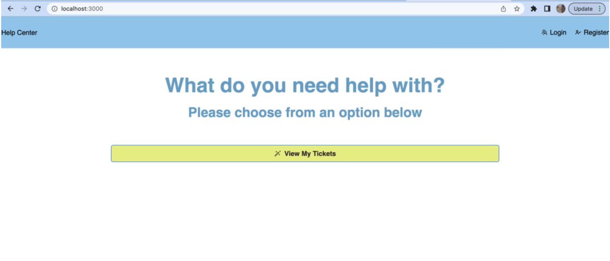
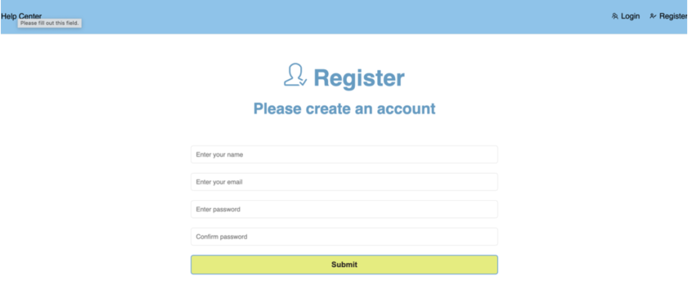
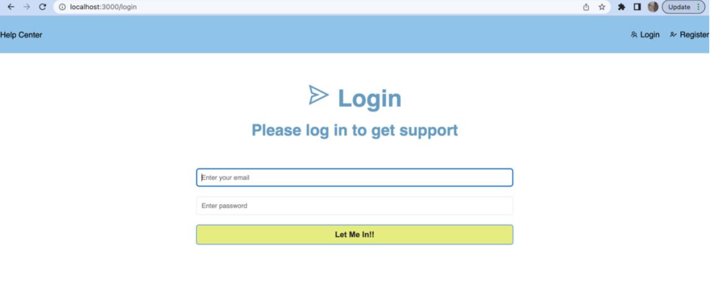
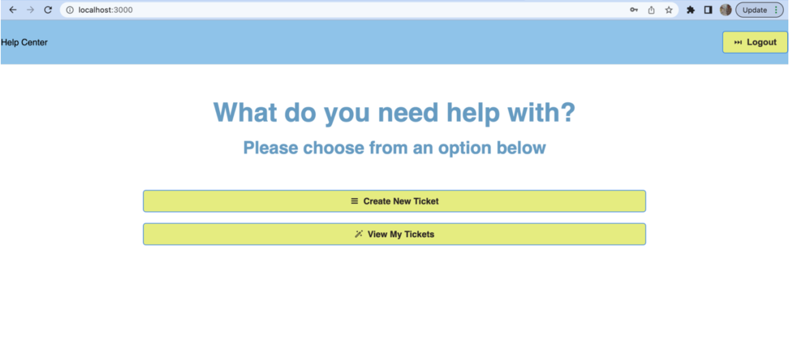
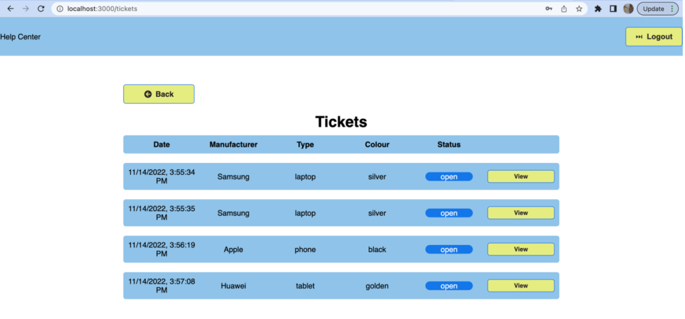
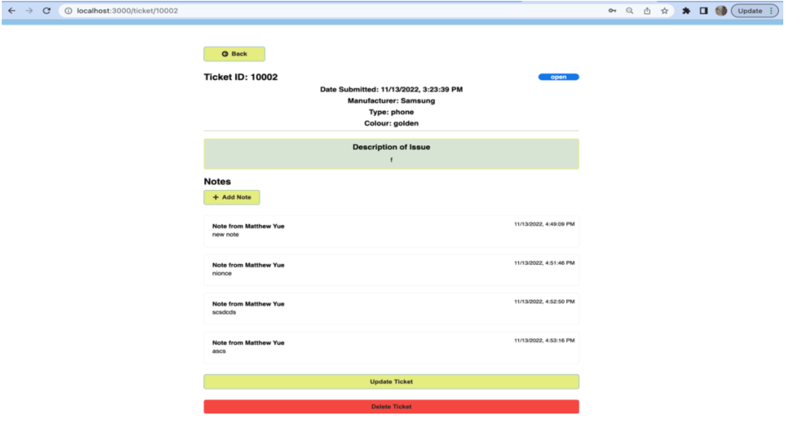

# Demo

Home screen when user tries to go to our webpage:

## Registration:

Register Page:

We check for user's email to prevent duplicate registration.

We also don't allow users with empty password or password not match.

## Login:

Login Page:

## Pages when User successfully loged in:

Home page:

When user clicked on `View My Tickets` Button, a list of the tickets that belongs to the logged in user will be displayed:

A user can also view a specific ticket's detail and able to modify and delete it.

We also enabled `websocket` to allow real time updates of notes.
